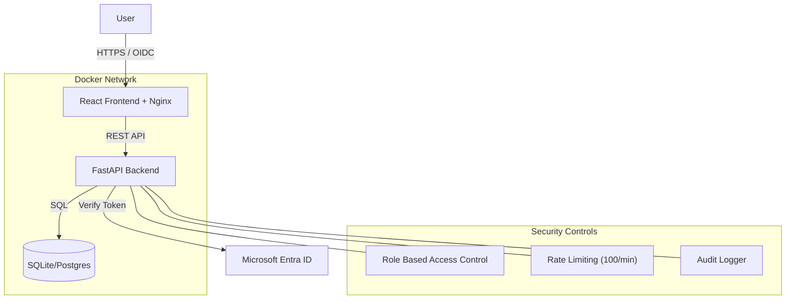
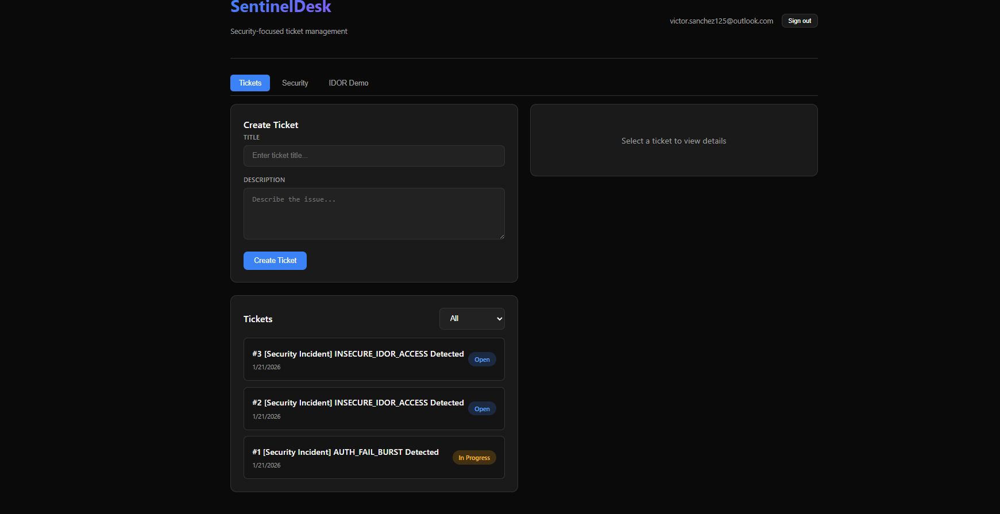
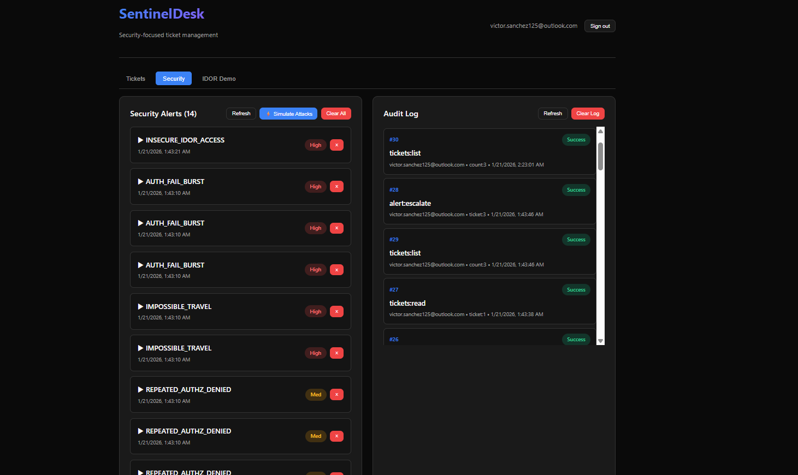
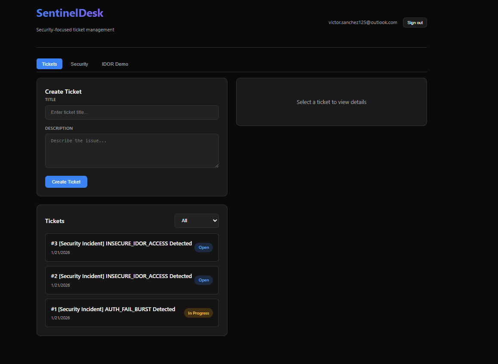
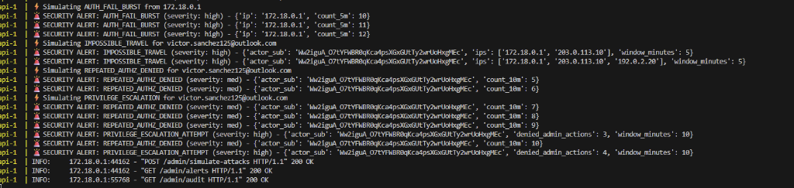

# SentinelDesk 🛡️


**A Secure-by-Design SOAR (Security Orchestration, Automation, and Response) Platform.**

This project demonstrates a full-stack security application engineered with a focus on **Identity Access Management (IAM)** and **DevSecOps** principles. It features real-time threat detection, role-based access control (RBAC), and automated containment workflows.

---

## 🏗️ Architecture



---

## 🚀 Key Features

### 1. Identity & Access Management (IAM)
- **Microsoft Entra ID Integration:** Modern OIDC authentication flow.
- **Granular RBAC:** Distinct roles (`Viewer`, `Analyst`, `Admin`) enforcing least-privilege access.
- **Token Validation:** Backend verifies JWT signatures, issuers, and audiences (no blind trust).

### 2. Threat Detection Engine
- **Impossible Travel:** Detects logins from geographically distant IPs within short timeframes.
- **Privilege Escalation:** Flags repeated `403 Forbidden` attempts on sensitive endpoints.
- **IDOR Protection:** Explicit ownership checks preventing Insecure Direct Object Reference attacks.

### 3. DevSecOps & Pipeline
- **Dockerized Infrastructure:** Multi-stage builds for minimal attack surface.
- **Automated Testing:** `pytest` suite verifying security logic (e.g., verifying IDOR fails for unauthorized users).
- **Vulnerability Management:**
  - ✅ **SAST:** Scanned with `Bandit` (0 High/Medium issues).
  - ✅ **DAST:** Scanned with **OWASP ZAP** (Baseline compliance verified).

---

## 📸 Interface

| Security Dashboard | Threat Alerts |
|:---:|:---:|
|  |  |
| *Real-time metrics and audit logs* | *Correlation of security events* |

| Ticket Management | Attack Simulation |
|:---:|:---:|
|  |  |
| *SOAR workflow for incident response* | *Triggering detections for demo* |

---

## 🛠️ Tech Stack

- **Frontend:** React 18, TypeScript, Tailwind/CSS (Glassmorphism UI)
- **Backend:** Python 3.11, FastAPI, SQLAlchemy
- **Infrastructure:** Docker, Docker Compose, Nginx
- **Security Tools:** OWASP ZAP, Bandit, JWT.io

---

## ⚡ Quick Start

### Prerequisites
- Docker Desktop installed & running.
- Microsoft Entra ID Tenant (for `.env` configuration).

### Run with Docker (Recommended)
The entire stack is containerized for easy deployment.

```bash
# 1. Clone the repo
git clone https://github.com/yourusername/sentineldesk.git

# 2. Configure Environment
# (Rename .env.example to .env and add your Client IDs)

# 3. Launch
docker-compose up --build
```

Access the application at: **http://localhost:3000**

---

## 🔒 Security Report
View the full [Security Assessment Report](./security_report.md) for detailed scan metrics.

### Detection Logic Example (Python)
```python
# Prevention of Vertical Privilege Escalation
if required_permission not in user_permissions:
    audit_log(event="authz:denied", reason="insufficient_privileges")
    raise HTTPException(status_code=403, detail="Access Denied")
```

---

*Built by Victor Sanchez as a demonstration of Cloud Security Engineering competencies.*

<!-- Triggering CI for Status Checks -->
